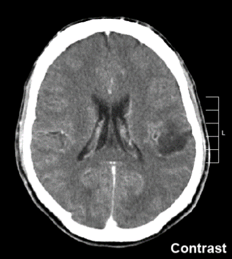
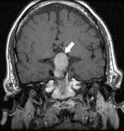
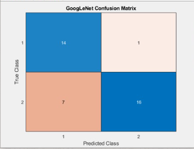
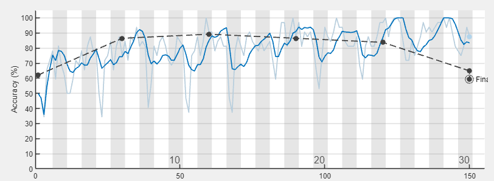
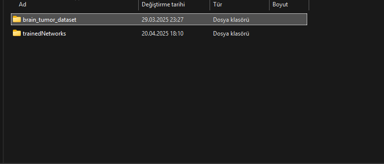

# Brain Tumor Classification using MATLAB

This MATLAB project performs classification of brain tumors from MRI images using deep learning models. It provides both training and testing capabilities, along with a graphical user interface (GUI) for post-training interaction.

## Overview

- Training and evaluation are done through `main.m`.
- The model is trained using either a custom CNN or GoogleNet.
- After training, users can select test images and perform classification through a user-friendly GUI.
- The GUI includes options to choose the model (CustomCNN or GoogleNet) and select optimization settings such as training intensity (low/high).

## How It Works

1. **Run `main.m`**  
   This script will:
   - Load and preprocess the dataset
   - Train the selected model (CustomCNN or GoogleNet)
   - Save the trained model to disk
   - Generate and save performance metrics, including confusion matrices

2. **Use the GUI**  
   After training is complete:
   - Launch the GUI script (`brain_tumor_gui_only.m`)
   - Select a test image for classification
   - Choose the trained model and adjust optimization settings as desired
   - View the classification result and related metrics

## Features

- Supports both lightweight custom CNN and pretrained GoogleNet
- GUI-based image selection and classification
- Model switching and optimization control
- Automatic generation of performance metrics
- MATLAB-based training and inference environment

## Requirements

- MATLAB R2021a or newer
- Deep Learning Toolbox
- Image Processing Toolbox
- Pretrained GoogleNet (optional, if using that model)

## How to Run

1. **Train the Model**
   - Run `main.m` to:
     - Load and preprocess the dataset from `brain_tumor_dataset/`
     - Train using either Custom CNN or GoogleNet
     - Save the trained model and generate performance metrics

2. **Use the GUI**
   - Run `brain_tumor_gui_only.m` to launch the graphical interface
   - Upload a test image
   - Choose model type and optimization level (low/high)
   - View classification result and metrics interactively

## Screenshots

Below are some example screenshots from the project:

## License

This project is licensed under the MIT License. See the `LICENSE` file for details.

## Contact

For questions or collaborations, contact:  
**mertcankankilic27@gmail.com**