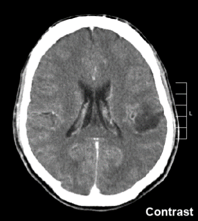
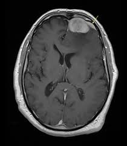
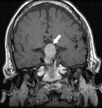
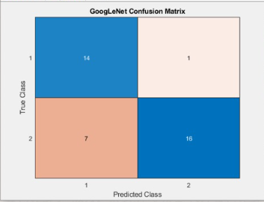
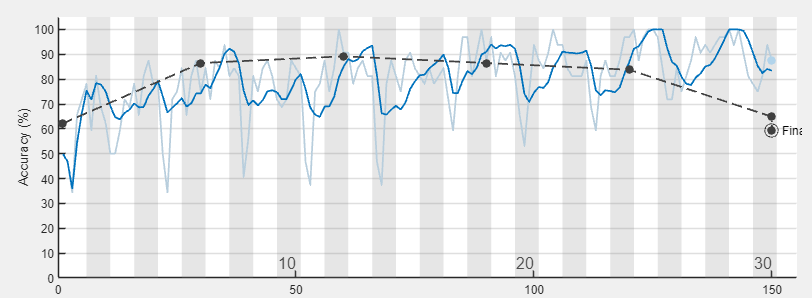

# Brain Tumor Classification using MATLAB

This MATLAB project performs classification of brain tumors from MRI images using deep learning models. It provides both training and testing capabilities, along with a graphical user interface (GUI) for post-training interaction.

## Overview

- Training and evaluation are done through `main.m`.
- The model is trained using either a custom CNN or GoogleNet.
- After training, users can select test images and perform classification through a user-friendly GUI.
- The GUI includes options to choose the model (CustomCNN or GoogleNet) and select optimization settings such as training intensity (low/high).

## How It Works

1. **Run `main.m`**
   - Load and preprocess the dataset
   - Train the selected model (CustomCNN or GoogleNet)
   - Save the trained model to disk
   - Generate and save performance metrics, including confusion matrices

2. **Use the GUI**
   - Launch the GUI script (`brain_tumor_gui_only.m`)
   - Select a test image for classification
   - Choose the trained model and adjust optimization settings as desired
   - View the classification result and related metrics

## Features

- Supports both lightweight custom CNN and pretrained GoogleNet
- GUI-based image selection and classification
- Model switching and optimization control
- Automatic generation of performance metrics
- MATLAB-based training and inference environment

## Requirements

- MATLAB R2021a or newer
- Deep Learning Toolbox
- Image Processing Toolbox
- Pretrained GoogleNet (optional, if using that model)

## How to Run

### 1. Train the Model
Run the training script:

```matlab
main
```

This will:
- Load and preprocess images from `brain_tumor_dataset/`
- Train the selected model (CustomCNN or GoogleNet)
- Save the model and performance reports

### 2. Use the GUI

Run the GUI script:

```matlab
brain_tumor_gui_only
```

Follow the steps below to classify an MRI image.

---

## Step-by-Step: GUI Usage

### 1. Launch the GUI

Once you run the script, the GUI window will open.



---

### 2. Load an MRI Image

Click **"Load Image"** to select a brain MRI image from your device.



---

### 3. Choose Model & Options

- **Model Type:** Choose either CustomCNN or GoogleNet
- **Training Intensity:** Low or High, affecting performance and accuracy



---

### 4. Classify the Image

Press **"Classify"** to let the trained model analyze the MRI image.



---

### 5. View Output

The classification result will be shown on screen. Metrics like accuracy and confusion matrix may also be displayed.



---

## Screenshots Summary

| Step | Description           | Image                         |
|------|-----------------------|-------------------------------|
| 1    | Launch GUI            |             |
| 2    | Select Test Image     |             |
| 3    | Choose Model/Options  |             |
| 4    | Classification        |             |
| 5    | Results               |             |

## License

This project is licensed under the MIT License. See the `LICENSE` file for details.

## Contact

For questions or collaborations, contact:  
**mertcankankilic27@gmail.com**
